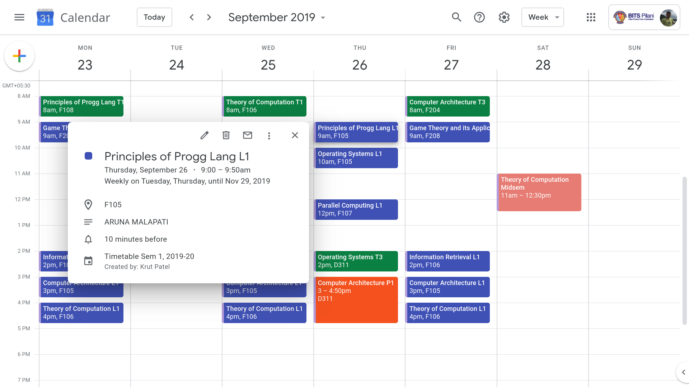

# ERP to Google Calendar

A script to create Google Calendar events for the entire semester for the courses you've enrolled in. These events can then be viewed on your phone via the calendar app. This is mainly intended for the use of students of [BITS Pilani](http://bits-pilani.ac.in).

## Features
+ Creates detailed calendar events with room and professor information.
+ Events are color-coded according to type (Lecture, Tutorial, Practical, etc.)
+ Includes Midsem and Compre Exam Events too.
+ You can override course sections to set them different from the ones you've registered to.
+ Automatically enrolls you into these courses on Moodle CMS

## Getting started
### Parsing
The app requires the excel version on the pdf given by Timetable Divison. To convert:
1. Extract the main timetable pages from the pdf into another pdf. (You can use a print to pdf service for this).
2. Use [this](https://ilovepdf.com/pdf_to_excel) site to convert to excel.

Follow same steps for midsem schedule, and also, convert the midsem excel to CSV format.

**OR**

You can use the pre-parsed timetable JSON file at [this](https://drive.google.com/drive/folders/1b9GT6G7xyj6Nr9xAfSBJit3rtP3hhd2F?usp=sharing) location (Use BITSmail to log in). I will try to update it every semester, but no guarantees.
NOTE: The timetable changes aren't reflected in the file. You can manually edit the file as necessary.

### Configuration
Config file is in [TOML](https://github.com/toml-lang/toml) format. See [`sample_config.toml`](sample_config.toml). After editing, use [this](http://toml-online-parser.ovonick.com/) site to validate your file.

Parameter | Explanation |
--------- | -----------
`MOODLE.wstoken`|The Moodle Mobile Web Service Key for your account. It can be acquired from Preferences -> Security Keys in the Moodle CMS website.
`DATES.last_date`|The last working date of the semester.
`DATES.midsem`|The official start and end dates of the midsem exams, when classwork is suspended. No need to set it according to your courses.
`COURSES.tt_file`|The path to the excel file of the timetable (See [Parsing](#Parsing) section) OR the path to the JSON file of the timetable that you've downloaded. IMP: Use single quotes `'`.
`COURSES.midsem_file`|Path to the CSV file of the midsem timetable. You can skip this (leave as it is) if you've specified the JSON file in the previous field, as the JSON file already contains the midsem info.
`COURSES.whitelist`|Only these courses and sections will be processed in calendar. Set as `{}` to process all. Useful for cases when you've already created the calendar, and have enrolled in a new course/new section.   NOTE: The courses should be those which you've registered to in ERP.
`COURSES.override`|Manually specify the sections of the courses, differently from what you've registered to in ERP. Useful when you prefer to go to another Lec/Tut/Lab, different from the official one. Set as `{}` to create the calendar for all the courses you've registered to in the ERP.    NOTE: You still need to be registered in the course in ERP. Only sections can be overriden.   NOTE: In case `COURSES.whitelist` is defined, this field should only contain those courses. 

### Installation
1. Clone the repo to a directory of your choice/click "[Download as zip](https://github.com/iamkroot/erp-gcal-cms/archive/master.zip)" and extract it.
2. Rename the `sample_config.toml` to `config.toml` and set the required values (See [Configuration](#Configuration) section). 
3. Ensure you have [Python 3.6](https://www.python.org/downloads/) or higher installed, and in your system `PATH`.
4. Install `pipenv` using `pip install pipenv`.
5. Inside the downloaded folder, run `pipenv install` in CMD or Terminal.

### Running
Use `pipenv run python main.py` to start the program. During the first run, it will ask you to authorize the app to access your Google Calendar Account. Select your BITS Google Account here. Then, the script will do the following automatically:
1. Login to your ERP, and fetch your registered courses from there.
2. Read the timetable JSON file, if provided. Otherwise, it will parse the timetable excel file (\~15 secs) and save the JSON version for future use.
3. Enroll you into the courses on Moodle CMS.
4. Start generating Google Calendar events for each section, midsem and compre.

#### Re-running for different users
By default, the program stores your Google account token, so that it can be reused without needing to login again.
If you want to run the program multiple times, for different users/Google accounts (of your friends, for example), then simply change their ERP and CMS credentials in the `config.toml`, and then run the program with `pipenv run python main.py -n` (here, `n` stands for "new creds"). This will cause the program to ignore the previously saved Google creds and prompt you for account access again.

## TODO
- [ ] Check calendar for pre-existing events. Currently, if the script is run multiple times, it will create duplicate events.
- [x] Add argument parsing to enable command line control
- [ ] Make CMS enrolment optional

## Contributing
Feel free to create a new issue in case you find a bug/want to have a feature added. Proper PRs are welcome.

## Authors
+ [Krut Patel](https://github.com/iamkroot)
